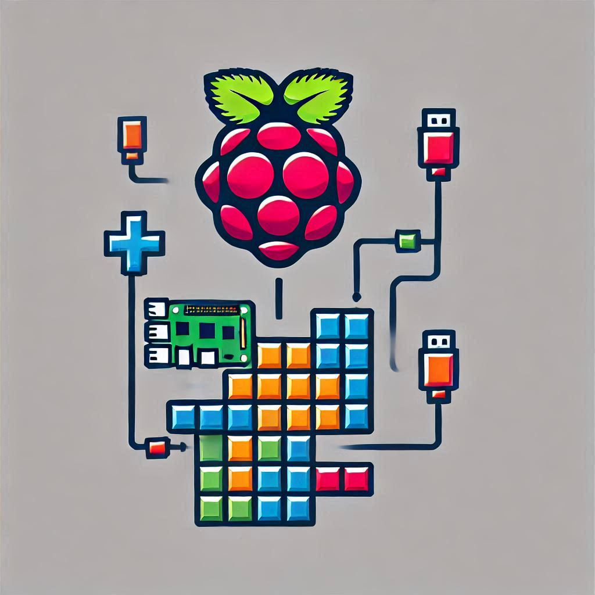

<a id="readme-top"></a>
<!-- README TEMPLATE -->
<!--
*** https://github.com/othneildrew/Best-README-Template
-->
[![Contributors][contributors-shield]][contributors-url]
[![Forks][forks-shield]][forks-url]
[![Stargazers][stars-shield]][stars-url]
[![Issues][issues-shield]][issues-url]
[![project_license][license-shield]][license-url]

<!-- PROJECT LOGO -->
<br />
<div align="center">
  <a href="https://github.com/Blitzyanic/RaspberryPi-Game-Project">
    
  </a>
  <br>
  *note: logo is ai generated

<h3 align="center">Raspberry Pi Game Project</h3>

  <p align="center">
    a Raspberry Pi Game with GPIO support created by Yanic and Nils for school
    <br />
    <a href="https://github.com/Blitzyanic/RaspberryPi-Game-Project/tree/main/docs"><strong>Explore the docs »</strong></a>
    <br />
    <br />
    <a href="https://github.com/Blitzyanic/RaspberryPi-Game-Project/issues/new?labels=bug&template=bug-report---.md">Report Bug</a>
    ·
    <a href="https://github.com/Blitzyanic/RaspberryPi-Game-Project/issues/new?labels=enhancement&template=feature-request---.md">Request Feature</a>
  </p>
</div>


<!-- TABLE OF CONTENTS -->
<details>
  <summary>Table of Contents</summary>
  <ol>
    <li>
      <a href="#about-the-project">About The Project</a>
      <ul>
        <li><a href="#built-with">Built With</a></li>
      </ul>
    </li>
    <li>
      <a href="#getting-started">Getting Started</a>
      <ul>
        <li><a href="#prerequisites">Prerequisites</a></li>
        <li><a href="#installation">Installation</a></li>
      </ul>
    </li>
    <li><a href="#roadmap">Roadmap</a></li>
    <li><a href="#license">License</a></li>
    <li><a href="#contact">Contact</a></li>
  </ol>
</details>


<!-- ABOUT THE PROJECT -->
## About The Project

[![Product Name Screen Shot][product-screenshot]](https://example.com)

this repo is a pygame Tetris clone for the raspberry pi with GPIO controls 

```
- made for school
- fork but not push to base project
- some elements might be in german
```

<p align="right">(<a href="#readme-top">back to top</a>)</p>


### Built With


<p align="right">(<a href="#readme-top">back to top</a>)</p>


<!-- GETTING STARTED -->
## Getting Started

### Prerequisites

* python
* virtualenv (for python)
* raspberry pi 4 B or 5 B
* jump wires
* 3x LED
* 3x 220 Ohm resistor
* 1x Button module
* 1x Joystick module
* 1x Breadboard
* 1x PCF8591 ADC module

### Installation

1. Clone the repo
   ```sh
   git clone https://github.com/Blitzyanic/RaspberryPi-Game-Project.git
   ```
2. Install Python Packages
   ```sh
   chmod +x INSTALL_DEV_STUFF_FOR_LINUX.sh
   ./INSTALL_DEV_STUFF_FOR_LINUX.sh
   ```
3. Follow the Docs for Raspberry Pi and GPIO setup
https://github.com/Blitzyanic/RaspberryPi-Game-Project/tree/main/docs
4. start the Program 
  ```sh
   python src/game/main.py
   ```

make sure the following packages are installed on your raspberry or linux development machine:
for Debian-Based (Rasbian)
```sh
sudo apt install python3 python3-virtualenv
```
for Arch-Based:
```sh
sudo pacman -S python python-virtualenv 
```

if you want to Develop on a Windows machine install Python and run
```powershell
.\INSTALL_DEV_STUFF_FOR_WINDOWS.ps1
```

<p align="right">(<a href="#readme-top">back to top</a>)</p>


<!-- ROADMAP -->
## Roadmap

- [ ] add Game
- [ ] add Raspberry Pi GPIO support
  - [ ] add Joystick support
  - [ ] add Button support
  - [ ] add LED support

Optional:
- [ ] add title screen
- [ ] add death screen

See the [open issues](https://github.com/Blitzyanic/RaspberryPi-Game-Project/issues) for a full list of proposed features (and known issues).

<p align="right">(<a href="#readme-top">back to top</a>)</p>


### Top contributors:

<a href="https://github.com/Blitzyanic/RaspberryPi-Game-Project/graphs/contributors">
  
</a>


<!-- LICENSE -->
## License

Distributed under the GNU GENERAL PUBLIC LICENSE V3. See `LICENSE` for more information.

<p align="right">(<a href="#readme-top">back to top</a>)</p>


<!-- CONTACT -->
## Contact

Yanic - yanic.dev@gmail.com - https://github.com/Blitzyanic

Nils  - [@puckiiOLykos](https://x.com/puckiiOLykos) - https://github.com/derpuckii

Project Link: [https://github.com/Blitzyanic/RaspberryPi-Game-Project](https://github.com/Blitzyanic/RaspberryPi-Game-Project)

<p align="right">(<a href="#readme-top">back to top</a>)</p>


# Usefull Links:
[Python](https://www.python.org/)
[PyGame](https://www.pygame.org/docs/)
[PyCharm¹ (Recomended IDE)](https://www.jetbrains.com/de-de/pycharm/download/)

<br>
<br>
<br>

_¹PyCharm Community is free, the Download link is below the Professional_
<p align="right">(<a href="#readme-top">back to top</a>)</p>


<!-- MARKDOWN LINKS & IMAGES -->
<!-- https://www.markdownguide.org/basic-syntax/#reference-style-links -->
[contributors-shield]: https://img.shields.io/github/contributors/Blitzyanic/RaspberryPi-Game-Project.svg?style=for-the-badge
[contributors-url]: https://github.com/Blitzyanic/RaspberryPi-Game-Project/graphs/contributors
[forks-shield]: https://img.shields.io/github/forks/Blitzyanic/RaspberryPi-Game-Project.svg?style=for-the-badge
[forks-url]: https://github.com/Blitzyanic/RaspberryPi-Game-Project/network/members
[stars-shield]: https://img.shields.io/github/stars/Blitzyanic/RaspberryPi-Game-Project.svg?style=for-the-badge
[stars-url]: https://github.com/Blitzyanic/RaspberryPi-Game-Project/stargazers
[issues-shield]: https://img.shields.io/github/issues/Blitzyanic/RaspberryPi-Game-Project.svg?style=for-the-badge
[issues-url]: https://github.com/Blitzyanic/RaspberryPi-Game-Project/issues
[license-shield]: https://img.shields.io/github/license/Blitzyanic/RaspberryPi-Game-Project.svg?style=for-the-badge
[license-url]: https://github.com/Blitzyanic/RaspberryPi-Game-Project/blob/master/LICENSE.txt
[product-screenshot]: docs/img/sample.png
